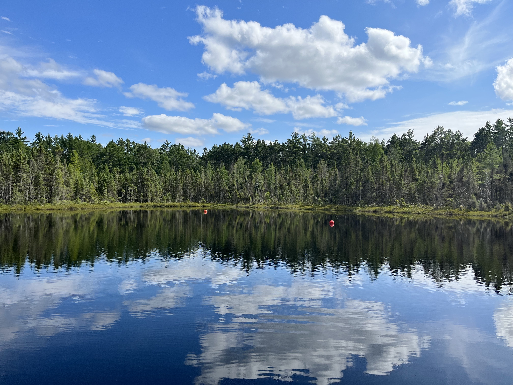

 

We value providing actionable information to practitioners in conservation and natural resource management. As such, we create decision support tools as products of some research projects. A selection of these tools are linked below:

[Trends in resilience indicators for California fish populations](https://jon-walter.shinyapps.io/fish-ewi-app/)

 

{width=450px}