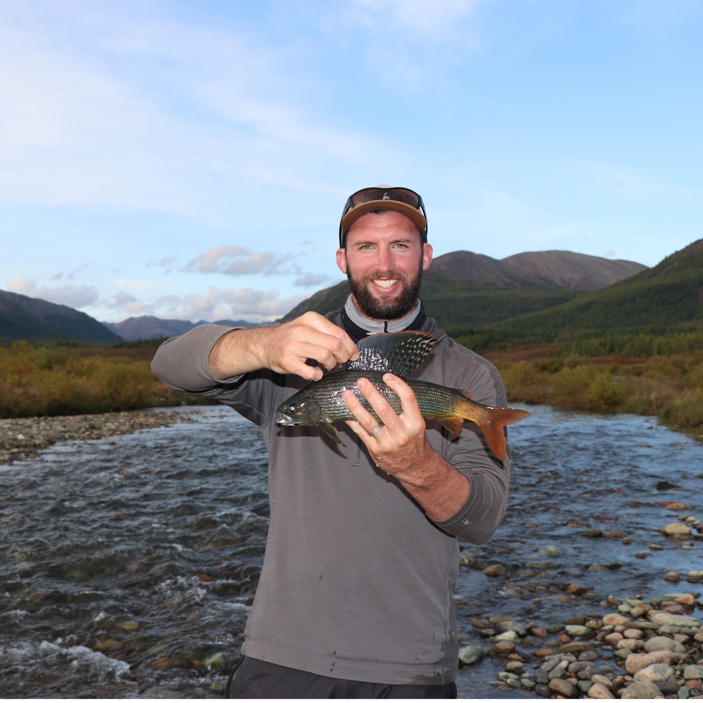

 

***
#### Jonathan Walter (Senior Researcher, Lab PI)
{width=180px}

Jon uses data-intensive and computational approaches to understanding the dynamics of environmental systems and how to improve the practice of conservation and natural resource management. He is especially interested in the dynamics of aquatic ecosystems and the organisms that inhabit them, and in using quantitative techniques to solve research problems that integrate across areas of knowledge and organizational scales. Jon is also the managing director of the Pacific Aquatic Telemetry Hub (PATH), a node of the Ocean Tracking Network and the primary repository for 69kHz (e.g., Vemco) acoustic telemetry data in California. 

He earned his PhD in Environmental Sciences from the University of Virginia and has been a researcher or instructor at Virginia Commonwealth University, the University of Kansas, the University of Virginia, and the University of Richmond prior to joining UC Davis.

Contact: jawalter@ucdavis.edu | [Google Scholar](https://scholar.google.com/citations?user=F_0J7Y4AAAAJ&hl=en) | [Github](https://github.com/jonathan-walter)

***
#### David Ayers (Postdoctoral Researcher)
{width=180px}

Dave is interested in how environmental cycles mediate animal behavior and influence the efficacy of conservation actions. For his PhD, he designed field experiments to elucidate movement and predation dynamics of tidal wetland fishes. This culminated in a habitat suitability model, intended to help optimize restoration design for fishes in a variety of coastal wetlands ecosystems.

Dave is now seeking to better understand how tidal and day-night cycles influence the swimming behavior of juvenile salmon. He looks forward to gleaning these insights from archival acoustic telemetry datasets in the California Delta. Ultimately, Dave seeks to help align flow management actions with fish behavior tendencies in a way that maximizes emigration survival for imperiled Central Valley salmon.