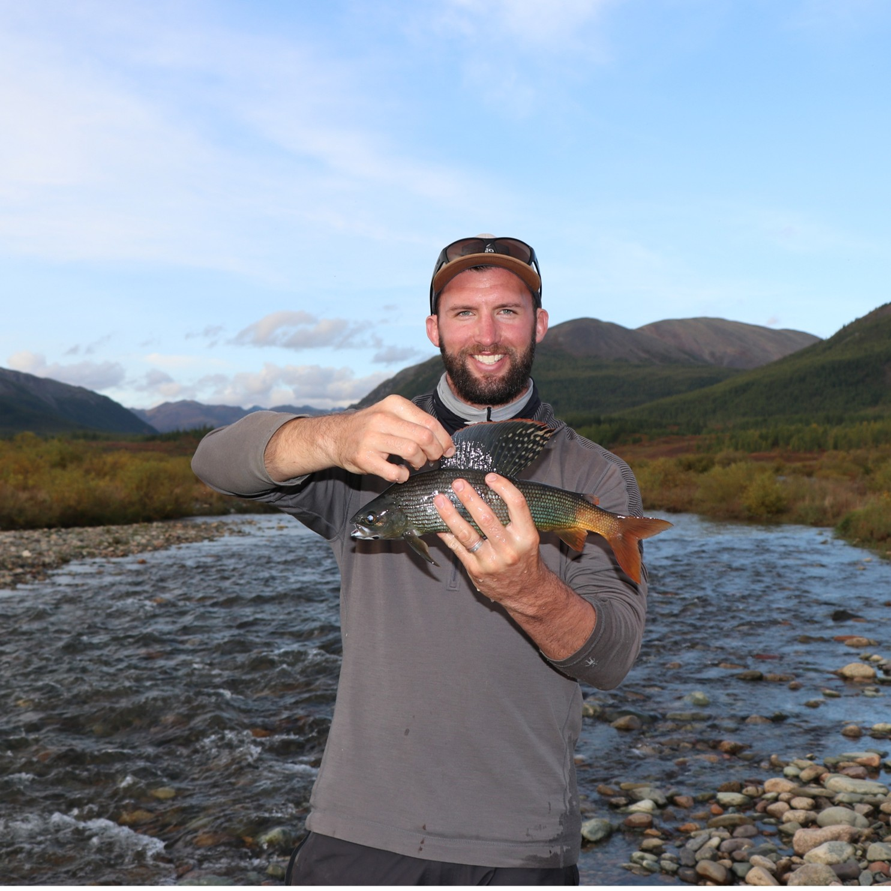
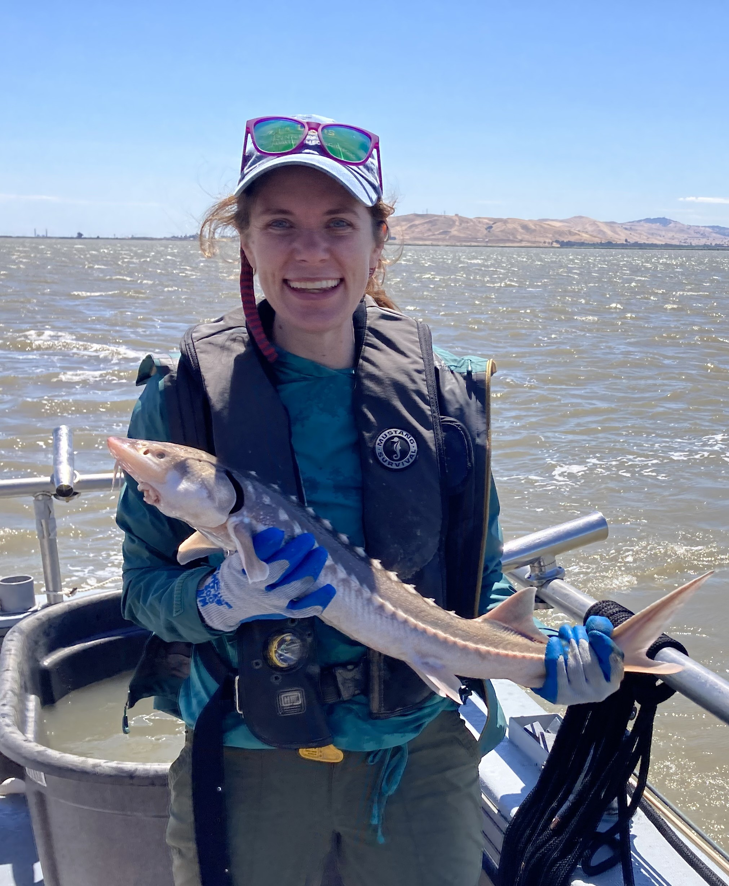
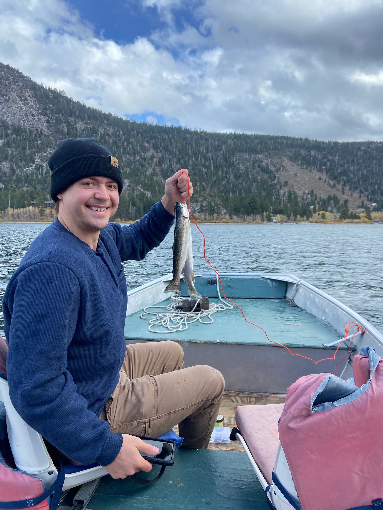

 

***
#### Jonathan Walter (Senior Researcher, Lab PI)
{width=180px}

Jon specializes in applying data-intensive and computational approaches to understand the dynamics of environmental systems and how to improve the practice of conservation and natural resource management. He is especially interested in the dynamics of aquatic ecosystems and the organisms that inhabit them, and in using data and models to solve research problems that integrate across areas of knowledge and organizational scales. Jon is also the manager of the [Pacific Aquatic Telemetry Hub (PATH)](https://path.wfcb.ucdavis.edu/), a node of the Ocean Tracking Network and the primary repository for 69kHz (e.g., Vemco) acoustic telemetry data in California inland waters. 

He earned his PhD in Environmental Sciences from the University of Virginia and has been a researcher or instructor at Virginia Commonwealth University, the University of Kansas, the University of Virginia, and the University of Richmond prior to joining UC Davis.

Contact: jawalter@ucdavis.edu | [Google Scholar](https://scholar.google.com/citations?user=F_0J7Y4AAAAJ&hl=en) | [Github](https://github.com/jonathan-walter)

***
#### David Ayers (Postdoctoral Researcher)
{width=180px}

Dave is interested in how environmental cycles mediate animal behavior and influence the efficacy of conservation actions. For his PhD, he designed field experiments to elucidate movement and predation dynamics of tidal wetland fishes. This culminated in a habitat suitability model, intended to help optimize restoration design for fishes in a variety of coastal wetlands ecosystems.

Dave's current research focuses on improving quantification of predator-prey interactions and mortality rates of outmigrating juvenile salmon. He looks forward to gleaning these insights from synthesizing archival acoustic telemetry and other monitoring datasets in the California Delta. Ultimately, Dave seeks to help align flow management actions with fish behavior in a way that maximizes emigration survival for imperiled Central Valley salmon.

Contact: deayers@ucdavis.edu

***
#### Erin Tracy (Postdoctoral Researcher)
{width=180px}

Erin is broadly interested in the study of both social and ecological aspects of aquatic conservation and in effectively communicating this research to natural resource managers, students, and the public. Her master’s research at Michigan State included a qualitative study on climate change perceptions in natural resource management organizations and a quantitative study on the influence of landscape features and climate change on aquatic habitats and fisheries. Her PhD research at UC Davis included modeling species richness and distribution of freshwater fish in Central Chile as well as managing the Pacific Aquatic Telemetry Hub (PATH) database and analyzing telemetry data to inform Green Sturgeon and flow management. Erin’s postdoctoral work at UC Davis will integrate fisheries movement data, hydrology, and policy to support fisheries management and conservation. 

Contact: eetracy@ucdavis.edu | [Google Scholar](https://scholar.google.com/citations?user=v3oBEQ4AAAAJ&hl=en)

***
#### Alyse Lacey (M.S. Student; co-mentored with John Durand)
{width=150px}

Alyse is interested in how to conserve and manage native fishes here in California. She is also  passionate about reintroduction efforts to historical habitats and monitoring species success. During her undergraduate career she investigated the correlations between Cichlid fish body measurements and their weights. This research aimed to determine the best ways to handle fish in the field to minimize stress and human interaction. Alyse’s MS research at UC Davis investigates how predators, phytoplankton production, and environmental conditions shape the spatiotemporal distribution of zooplankton on the Sacramento-San Joaquin Delta and their role as prey for native fishes.

Contact: alacey@ucdavis.edu

***
#### Jesse Schroeder (Junior Specialist)
{width=150px}

Jesse is interested in restoration practices that elucidate the complex mechanisms of fish behavior in tidal systems. He earned a B.S. in Wildlife, Fish, and Conservation Biology from the University of California, Davis, where he began work investigating juvenile salmon predation dynamics and generating novel habitat suitability metrics in restored wetlands.

Jesse’s time at UC Davis showed him that large-scale environmental restoration necessitates the development and adoption of equitable scientific methods. In pursuit of this, he spent his early career at the US Geological Survey developing low-cost remote water-quality sensing devices and methods to record spatial water quality in hard-to-access marsh channels. With support from the Walter Lab, he’s now working to generate an R package that estimates habitat suitability in tidal systems, and hopes to facilitate widespread use of the tool to bolster restoration practices throughout the San Francisco Estuary and beyond.

Contact: jrschroeder@ucdavis.edu