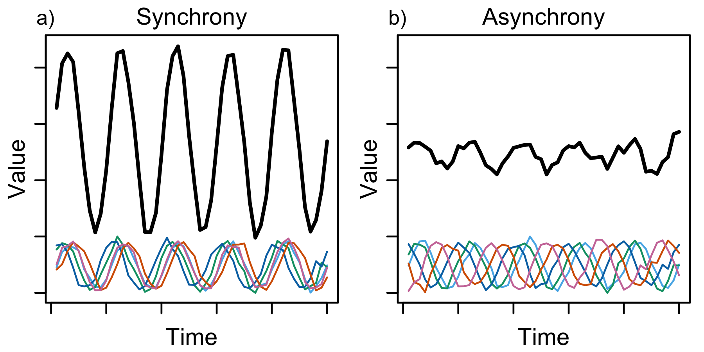

 

Research in the Walter Lab spans different habitat types, kinds of organisms, and organizational scales, but is unified by an emphasis on applying quantitative methods to understand how and why systems change. Some current research foci include:

**Ecological synchrony:** Synchrony is a common feature of ecological systems (and complex systems in other domains) which manifests as a tendency for life history events, or fluctuations in key variables like species’ abundances or biogeochemical concentrations, to coincide in time. Synchrony fundamentally shapes systems’ stability and resilience because synchronous fluctuations reinforce each other and total to large system-wide effects, while asynchrony tends to allow some components to compensate for losses in others. Current research in the lab focuses on how species life history and functional traits mediate synchrony of populations and communities.

{alt="Illustration of synchrony and its consequences. Synchrony among system components (colored lines) leads to high total variance (low stability) in the total (black line) compared to asynchrony. Classically, system components may be populations of the same species in different locations (spatial synchrony) or abundances of different species in the same location (community synchrony). Many other kinds of ecological variables, including biogeochemical rates and concentrations can exhibit synchrony" width=400px}

*Illustration of synchrony and its consequences. Synchrony among system components (colored lines) leads to high total variance (low stability) in the total (black line) compared to asynchrony. Classically, system components may be populations of the same species in different locations (spatial synchrony) or abundances of different species in the same location (community synchrony). Many other kinds of ecological variables, including biogeochemical rates and concentrations can exhibit synchrony.*

 

**Sturgeon movement and population dynamics:** Green (*Sinosturio medirostris*; formerly *Acipenser medirostris*) and white (*S. transmontanus*) sturgeon are native fishes whose populations in Central California are imperiled. We are using quantitative syntheses of acoustic telemetry data and individual-based models to uncover new understandings of their movement behaviors and habitat use in response to flows and potential threats like toxic algal blooms, and to project outcomes for sturgeon under climate change and water management scenarios.

**Aquatic heatwaves and thermal regimes:** Temperature is a fundamental driver of ecosystem processes and organism physiology. We focus on the patterns and consequences of aquatic heatwaves, prolonged periods of unusually high temperatures. Our work has shown that heatwaves in river temperatures have become more prevalent over time as the climate has warmed; ongoing work investigates the roles of river network structure and water management in mediating patterns of co-occurrence of riverine heatwaves in the Western US. We are also interested in impacts of wildfire on river temperatures. 

**Improving water management for Chinook salmon:** California’s central valley is home to the southernmost populations of Chinook salmon, but a legacy of dam and levee construction, floodplain development, and water extraction has reduced Chinook salmon abundances to a fraction of their historical numbers, resulting in fishery closures and legal protections. We study impacts of water temperature and flows on Chinook salmon behavior and population dynamics with an aim of improving water management outcomes for fish and people.

{alt="Lake Berryessa from the northern shoreline" width=480px}

